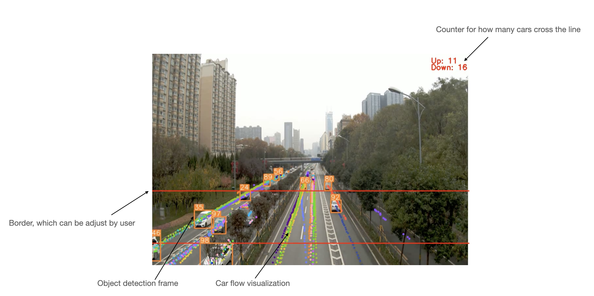

# Car Tracking system


<div align="center">

 

<br>
</div>


## Introduction

***This repository is based on this [repo](https://github.com/mikel-brostrom/Yolov5_DeepSort_Pytorch)***

In this repo, users can build a real-time tracker for cars.
The output of the system is a video marked by the car route. In addition, the user can define red lines to calculate how many cars pass through these lines.

## Preparation

1. Clone the repository recursively:

`git clone --recurse-submodules https://github.com/chiluen/CarTracking.git`


2. Run:

`pip install -r requirements.txt`


## Running the code

Tracking can be run on most video formats

```bash
$ python track.py --source /path/to/video
                  --save-vid
                  --yolo_model yolo5s.pt
                  --line-distance 420,140,-1,-1 # red line(border) distance for[Up, Down, Left, Right]
```

After running the script, you will get the output.mp4 at ```./runs/track/exp{number}```, then you can use or follow [Demo.ipynb](./Demo.ipynb) to get the video in jupyter notebook.

